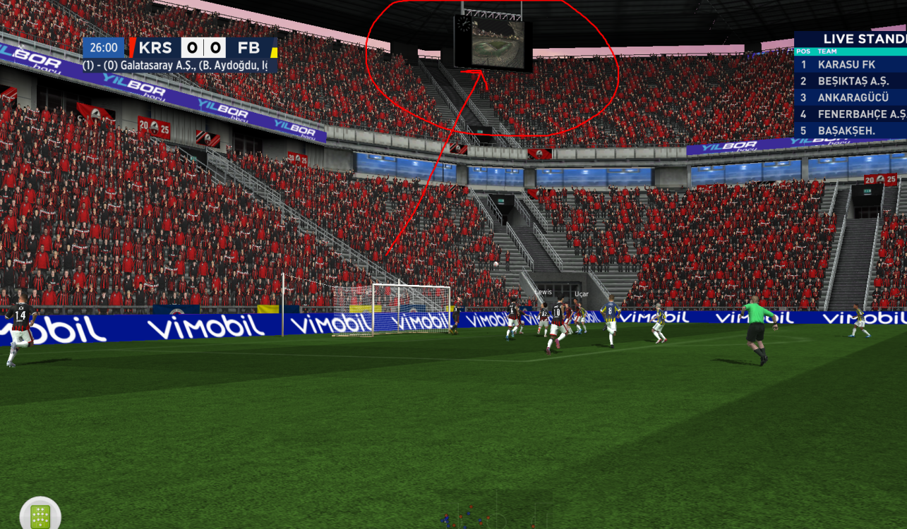
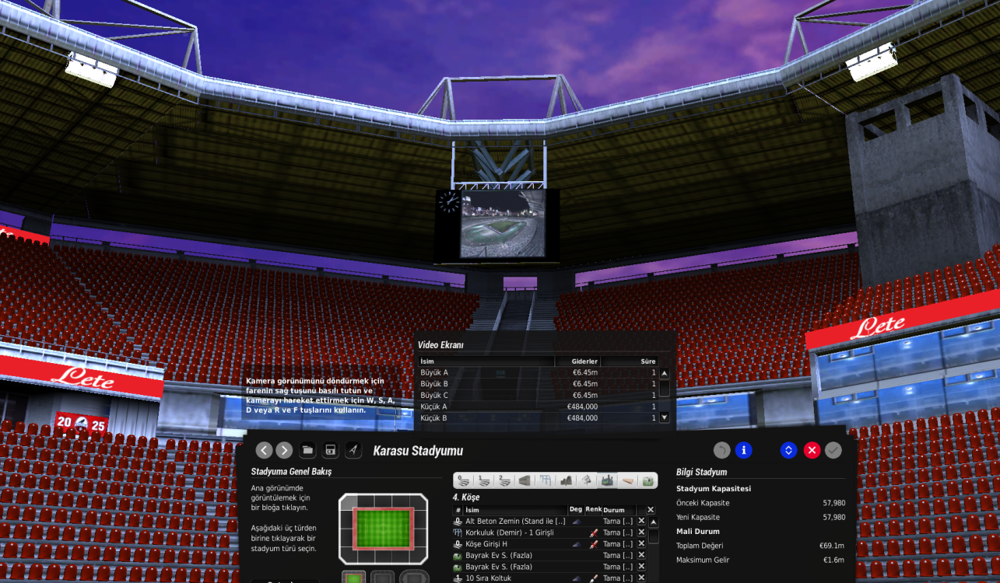

# Fifa Manager Unlock Corner Scoreboard Mod

Video scoreboards on corner sections in the FIFA Manager stadium editor.

Works with **FIFA Manager 13**, **FIFA Manager 14**, and **FIFA Manager 26**.

## Screenshots

### In-game (corner section)

  

<em>Scoreboard in front of the corner stand.</em>

### Stadium editor

  

<em>Video Screen sizes unlocked on a corner tribune.</em>

## What it does

On corner-type stadiums, the vanilla editor limits scoreboard options on corners. Boards can spawn behind the roof, outside the stand, or in a spot you can't use.

This mod unlocks the full Video Screen list on corner sections and moves placement to the front of the stand.

## Warning

This is a corner-only fix. It replaces global stadium files.

| Works | Does not work |
|-------|---------------|
| Corner tribunes | Behind-goal tribunes |
| All Video Screen sizes on corners | Main and marathon stands |
| Stable corner placement | Other non-corner sections |

If you need scoreboards on behind-goal or marathon stands, restore your vanilla backup for that work.

Back up these files before installing:
- `data\stadium\generator\StadiumDB.xml`
- `data\stadium\generator\Stadelems.big`

## Changed files

| File | What it does |
|------|--------------|
| `StadiumDB.xml` | Unlocks Video Screen links on corner blocks |
| `Stadelems.big` | Moves the corner scoreboard mesh forward (`bc_5_0903`) |

All corner sizes use the Large A mesh on corners. That keeps placement stable.

## Install

**From Releases**

1. Download `Fifa_Manager_Unlock_Corner_Scoreboard_Mod.zip`.
2. Extract and copy the `data` folder into your game directory.
3. Overwrite when asked.

**From this repo**

Copy `data/stadium/generator/StadiumDB.xml` and `Stadelems.big` into `[Game]\data\stadium\generator\`.

Full guide: [docs/INSTALL.md](docs/INSTALL.md)

## In-game

1. Open a corner-type stadium.
2. Select a corner tribune section.
3. Pick a Video Screen size.
4. Delete any old scoreboard on that corner, then place again.
5. Save the stadium.

## Uninstall

Put your backed-up `StadiumDB.xml` and `Stadelems.big` back into `data\stadium\generator\`.

## Compatibility

| Game | Folder |
|------|--------|
| FIFA Manager 13 | `[Game]\data\stadium\generator\` |
| FIFA Manager 14 | `[Game]\data\stadium\generator\` |
| FIFA Manager 26 | `[Game]\data\stadium\generator\` |

## Author

**[DNZYDeniz](https://github.com/DNZYDeniz)** (Deniz Yukarıçukur)

## License

MIT. See [LICENSE](LICENSE).
