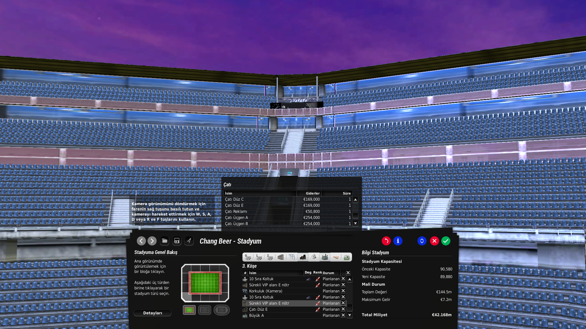
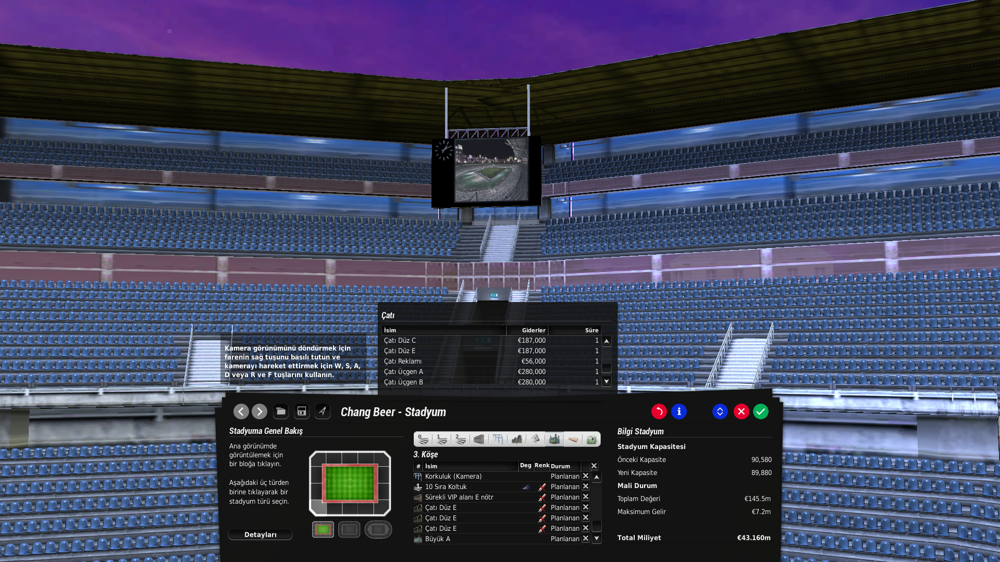

# Fifa Manager Unlock Corner Scoreboard Mod

Video scoreboards on corner sections in the FIFA Manager stadium editor.

Works with **FIFA Manager 13**, **FIFA Manager 14**, and **FIFA Manager 26**.

---

## READ THIS FIRST

### 1. Corner sections only

This mod **only** fixes scoreboards on **corner tribunes**.

While it is installed, scoreboards on **behind-goal** and **marathon / main** stands **stop working**. Use this mod only when you are editing **corners**. Restore your vanilla backup if you need behind-goal or marathon boards.

### 2. You must build a roof

The corner scoreboard **attaches to the roof**. It will not work without one.

**Build order:**
1. **Build the roof first**
2. While placing the roof, put it on the **lowest row** (bottom position)
3. **Place the scoreboard after the roof** (roof first, scoreboard second)

### 3. Scoreboard not visible?

If the roof is **too small**, the scoreboard can end up **inside the tribune** and you will not see it.

**Fix:** extend the roof outward, like in the screenshots below. Then place the scoreboard **after** the extended roof.

  

<em>Roof on the bottom row first. Scoreboard comes after the roof.</em>

  

<em>Roof too small? Extend it outward so the scoreboard stays visible.</em>

---

## Screenshots (mod result)

  

  

---

## What it does

On corner-type stadiums, the vanilla editor limits scoreboard options on corners. This mod unlocks the full Video Screen list on corner sections and fixes placement at the front of the stand.

## Warning (corners vs other stands)

| Works | Does not work |
|-------|---------------|
| Corner tribunes | Behind-goal tribunes |
| Video Screen on corners | Main and marathon stands |

Back up before installing:
- `data\stadium\generator\StadiumDB.xml`
- `data\stadium\generator\Stadelems.big`

## Install

1. Download `Fifa_Manager_Unlock_Corner_Scoreboard_Mod.zip` from [Releases](https://github.com/DNZYDeniz/fifamanager-corner-scoreboard-mod/releases).
2. Extract and copy the `data` folder into your game directory.
3. Overwrite when asked.

Full guide: [docs/INSTALL.md](docs/INSTALL.md)

## In-game (corners)

1. Open a corner-type stadium.
2. **Build the roof** on the corner (lowest row).
3. Select the corner tribune.
4. Place the **Video Screen after the roof**.
5. If the board is hidden, **extend the roof** and place again.
6. Save the stadium.

## Uninstall

Restore your backed-up `StadiumDB.xml` and `Stadelems.big` to `data\stadium\generator\`.

## Compatibility

| Game | Folder |
|------|--------|
| FIFA Manager 13 | `[Game]\data\stadium\generator\` |
| FIFA Manager 14 | `[Game]\data\stadium\generator\` |
| FIFA Manager 26 | `[Game]\data\stadium\generator\` |

## Author

**[DNZYDeniz](https://github.com/DNZYDeniz)** (Deniz Yukarıçukur)

## License

MIT. See [LICENSE](LICENSE).
